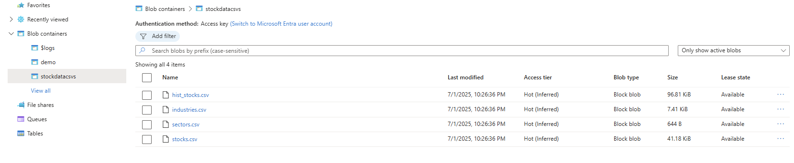
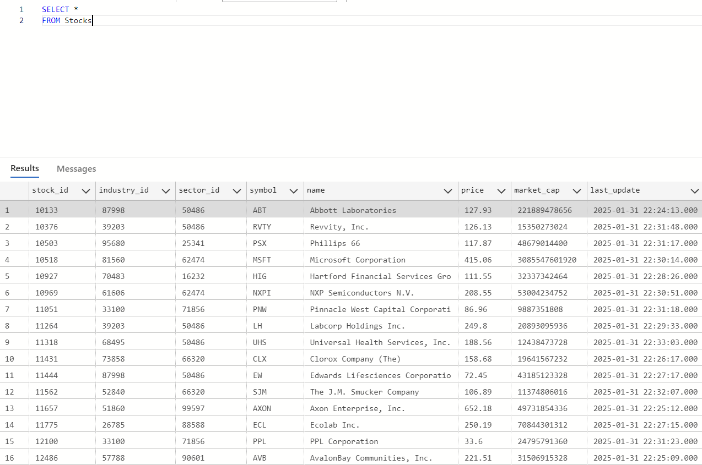
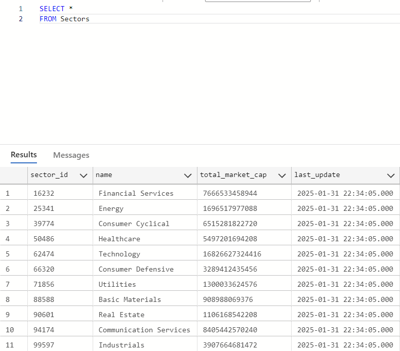

# ELT Pipeline for Stocks

## Overview
This project implements an ELT (Extract, Load, Transform) pipeline for stock market data, specifically focusing on S&P 500 companies. The pipeline extracts stock-related data, processes it, and loads it into a database for further analysis.

## Table of Contents
- [Features](#features)
- [Project Structure](#project-structure)
- [Installation](#installation)
- [Usage](#usage)
- [Database Design](#database-design)
- [Images](#images)
- [Future Improvements](#future-improvements)
- [Contributors](#contributors)

## Features
- Extracts S&P 500 stock tickers from Wikipedia
- Fetches stock data (name, industry, sector, price, market cap) using Yahoo Finance
- Organizes data into CSV and JSON formats
- Assigns unique IDs for stocks, industries, and sectors
- Stores data in Azure Blob Storage and an  Azure SQL database

## Project Structure
```

├── scripts
│   ├── tickergenerator.py          # Generates and stores S&P 500 tickers
│   ├── main.py                     # Main ETL processing script
│   ├── uploadToAzureBlobAndSQL.py  # Uploads data to Azure and SQL
│   ├── stockPriceUpdater.py        # Updates stock prices daily
│   ├── models.py                   # Defines database schema using SQLAlchemy
├── README.md                       # Project documentation
├── requirements.txt                # List of needed dependencies for the scripts
```

## Installation
### Prerequisites
- Python 3.7+
- Install dependencies:
  ```bash
    pip install -r requirements.txt
  ```

## Usage
### 1. Generate Tickers
```bash
python scripts/tickergenerator.py
```
This script fetches the S&P 500 tickers and initializes the necessary JSON and CSV files.

### 2. Fetch and Process Stock Data
```bash
python scripts/main.py
```
This script fetches stock data, assigns unique IDs, and updates the CSV files.

### 3. Upload Data to the Azure Blob storage and SQL Relational Database
```bash
python scripts/uploadToAzureBlobAndSQL.py
```

This script uploads the processed data to Azure Blob Storage and an SQL database.

### 4. Update the stock prices and market cap for the stocks
```bash
python scripts/stockPriceUpdater.py
```
This script updates stock prices and market capitalization for existing stocks.

## Database Design
The SQL database consists of three main tables: `Stocks`, `Industries`, and `Sectors`. Below is an overview of each table and its purpose:

### Tables
| Table Name  | Description |
|-------------|-------------|
| **Stocks**  | Stores information about each stock, including its ticker, name, industry, and sector. |
| **Industries**  | Contains industry information, linking each industry to a broader sector. |
| **Sectors**  | Represents high-level industry sectors, grouping multiple industries together. |

### Schema
#### **Stocks Table**
| Column Name   | Data Type    | Description |
|--------------|-------------|-------------|
| stock_id           | INT (PK)     | Unique identifier for each stock |
| industry_id  | INT (FK)     | Foreign key linking to Industries table |
| sector_id    | INT (FK)     | Foreign key linking to Sectors table |
| symbol       | VARCHAR(10)  | Stock ticker symbol |
| name         | VARCHAR(255) | Company name |
| price        | FLOAT        | Current stock price |
| market_cap   | FLOAT        | Market capitalization |
| last_updated | DATETIME     | Last updated timestamp | 

#### **Industries Table**
| Column Name  | Data Type    | Description |
|-------------|-------------|-------------|
| industry_id | INT (PK)     | Unique identifier for each industry |
| sector_id   | INT (FK)     | Foreign key linking to Sectors table |
| name        | VARCHAR(255) | Industry name |
| total_market_cap   | FLOAT        | Total market cap of the industry |
| last_updated | DATETIME     | Last updated timestamp | 


#### **Sectors Table**
| Column Name | Data Type    | Description |
|------------|-------------|-------------|
| sector_id         | INT (PK)     | Unique identifier for each sector |
| name       | VARCHAR(255) | Sector name |
| total_market_cap   | FLOAT        | Total market cap of the sector |
| last_updated | DATETIME     | Last updated timestamp | 

## Images
Below are visual representations of the data in Azure Blob Storage and the SQL database schema:

### CSV Files in Blob Storage


### SQL Database




## Future Improvements
- **Airflow DAG Implementation:**  
  - **Daily DAG (`daily_stock_update_dag.py`)**: Automates daily stock price updates by running `stockPriceUpdater.py`.  
  - **Quarterly DAG (`quarterly_data_update_dag.py`)**: Runs every quarter to update the ticker list and perform a full data refresh.  
    - Executes:  
      - `tickersgenerator.py` to update the stock tickers  
      - `main.py` to extract and process stock data  
      - `uploadToAzureBlobAndSQL.py` to upload updated data to Azure and SQL 
- Implement parallel processing for faster data retrieval
- Enhance error handling and logging
- Extend support for additional stock indices

## Contributors
- Malachi Rosario 