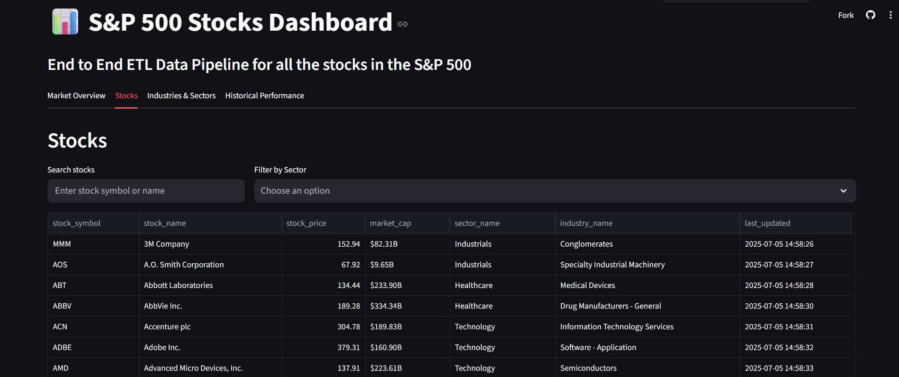
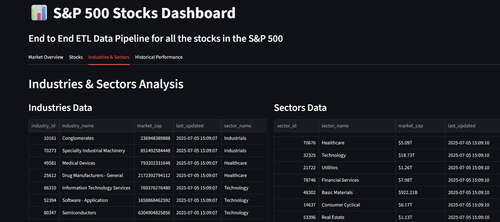
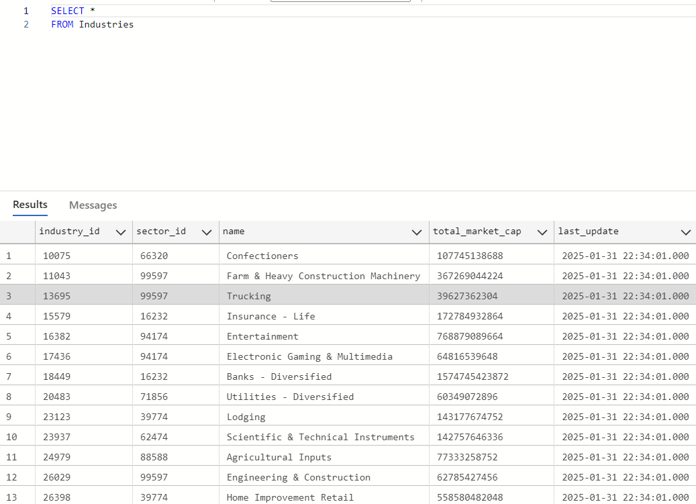

# S&P 500 Stocks ETL Pipeline and Dashboard


## Overview
This project is an End to End ETL pipeline and dashboard for tracking real-time and historical data on S&P 500 companies. It automates the extraction of stock data from Yahoo Finance and S&P 500 tickers from Wikipedia, then stores the processed data in Azure Blob Storage and an Azure SQL Database. Using Airflow, the pipeline runs hourly updates to stock prices and monthly refreshes of all company and market data. A Streamlit dashboard—deployed both locally and on Streamlit Cloud—allows users to explore market overviews, filter stocks by sector, analyze industry trends, and visualize historical price performance. The entire system is dockerized for portability and easy deployment.

**Link to streamlit cloud**: [Live Dashboard](https://malachir64-stockpricedatapipelineanddashboard-dashboard-xvtll9.streamlit.app/)

## Table of Contents
- [Features](#features)
- [Project Structure](#project-structure)
- [Installation](#installation)
- [Airflow](#airflow)
- [Streamlit Dashboard](#streamlit-dashboard)
- [Database Design](#database-design)
- [Contributors](#contributors)

## Features
- Extracts S&P 500 stock tickers from Wikipedia
- Fetches stock data (name, industry, sector, price, market cap) using Yahoo Finance
- Organizes data into CSV and JSON formats
- Assigns unique IDs for stocks, industries, and sectors
- Stores data in Azure Blob Storage and an Azure SQL database
- **Historical tracking** of stock prices via `hist_stocks.csv`
- **Airflow DAGs** for hourly and monthly automation
- **Streamlit dashboard** for real-time data exploration
- **Dockerized setup** for seamless deployment
- **Deployed to streamlit cloud**

## Project Structure
```
├── dag/
│   ├── scripts/
│   │   ├── tickergenerator.py           # Initializes JSONs CSVs with S&P 500 tickers
│   │   ├── main.py                      # Pulls fresh data & generates all CSVs, including history
│   │   ├── uploadToAzureBlobAndSQL.py   # Uploads CSVs to Azure Blob and populates Azure SQL
│   │   ├── stockPriceUpdater.py         # Hourly price updater with historical appending
│   │   ├── models.py                    # SQLAlchemy models for Stocks, Industries, and Sectors
│   ├── hourlyDag.py                     # Airflow DAG to run `stockPriceUpdater.py` hourly
│   ├── monthlyDag.py                    # Airflow DAG for full monthly refresh of all data
├── dashboard.py                         # Streamlit dashboard for stock insights
├── Dockerfile                           # Docker setup
├── docker-compose.yaml                  # Launches Airflow + Streamlit
├── requirements.txt                     # Python dependencies
├── env-example.txt                      # Environment variable template
```

## Installation

### Prerequisites
- Docker & Docker Compose
- Python 3.7+ (for standalone script testing)
- Azure Blob Storage and Azure SQL setup

### 1. Clone the repository
```bash
git clone https://github.com/MalachiR64/StockPriceDataPipelineAndDashboard.git
cd StockPriceDataPipelineAndDashboard
```

### 2. Create `.env` file
Copy `env-example.txt` to `.env` and fill in your credentials:
```env
CONNECT_STR_BLOB=your_azure_blob_connection_string
CONNECT_STR_SQL=your_azure_sql_connection_string
CONTAINER_NAME=your_container_name
```

### 3. Build and start the application
```bash
docker compose up --build
```

## Airflow

### DAGs (Automated in Docker)

- `hourly_stock_price_update`: Runs `stockPriceUpdater.py` every hour.
- `monthly_stock_update`: Refreshes all tickers and data monthly using:
  - `tickergenerator.py`
  - `main.py`
  - `uploadToAzureBlobAndSQL.py`

Access the Airflow UI:  
`http://localhost:8080`

### Manual Script Usage (Optional)

```bash
python scripts/tickergenerator.py
python scripts/main.py
python scripts/uploadToAzureBlobAndSQL.py
python scripts/stockPriceUpdater.py
```
## Streamlit Dashboard
The dashboard provides real-time insights into S&P 500 stock data pulled from Azure Blob Storage.
Access the dashboard in your browser:  
`http://localhost:8501`

tabs:
- **Market Overview** Key metrics like total stocks, average price, and market cap distribution by sector.


- **Stocks** Search and filter stocks by name or sector, and view detailed info including price and market cap.

- **Industries & Sectors**  Explore total market caps by industry and sector, and analyze their relationships.


- **Historical Performance** (from `hist_stocks.csv`) Visualize stock price trends over time using data from `hist_stocks.csv`, with support for multi-stock comparison and date filtering.


## Database Design

### CSV Files in Blob Storage
The pipeline stores processed data as CSVs in Azure Blob Storage, including:
- `stocks.csv`, `industries.csv`, `sectors.csv` for current values
- `hist_stocks.csv` for historical stock price tracking over time


### SQL Tables
The SQL database consists of three main tables: `Stocks`, `Industries`, and `Sectors`.
| Table Name  | Description |
|-------------|-------------|
| **Stocks**  | Stores information about each stock, including its ticker, name, industry, and sector. |
| **Industries**  | Contains industry information, linking each industry to a broader sector. |
| **Sectors**  | Represents high-level industry sectors, grouping multiple industries together. |

### Schema

#### **Stocks Table**
| Column Name   | Data Type    | Description |
|--------------|-------------|-------------|
| stock_id           | INT (PK)     | Unique identifier for each stock |
| industry_id  | INT (FK)     | Foreign key linking to Industries table |
| sector_id    | INT (FK)     | Foreign key linking to Sectors table |
| symbol       | VARCHAR(10)  | Stock ticker symbol |
| name         | VARCHAR(255) | Company name |
| price        | FLOAT        | Current stock price |
| market_cap   | FLOAT        | Market capitalization |
| last_updated | DATETIME     | Last updated timestamp |


#### **Industries Table**
| Column Name  | Data Type    | Description |
|-------------|-------------|-------------|
| industry_id | INT (PK)     | Unique identifier for each industry |
| sector_id   | INT (FK)     | Foreign key linking to Sectors table |
| name        | VARCHAR(255) | Industry name |
| total_market_cap   | FLOAT        | Total market cap of the industry |
| last_updated | DATETIME     | Last updated timestamp |



#### **Sectors Table**
| Column Name | Data Type    | Description |
|------------|-------------|-------------|
| sector_id         | INT (PK)     | Unique identifier for each sector |
| name       | VARCHAR(255) | Sector name |
| total_market_cap   | FLOAT        | Total market cap of the sector |
| last_updated | DATETIME     | Last updated timestamp |


## Contributors
- Malachi Rosario
